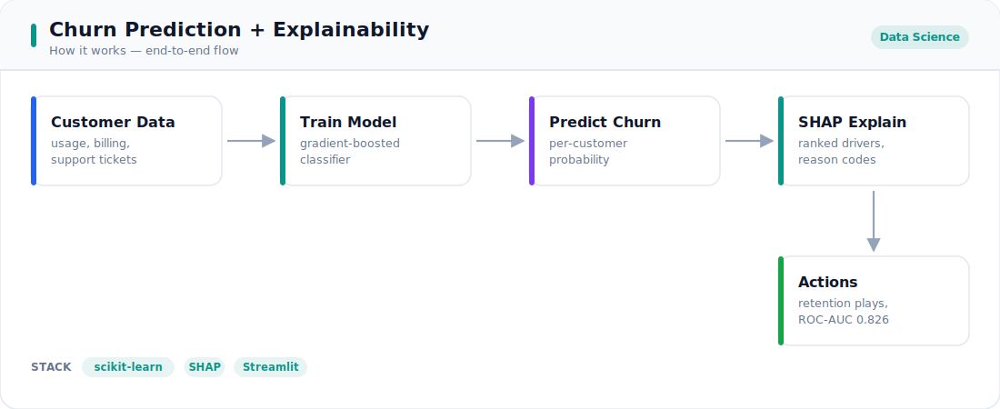
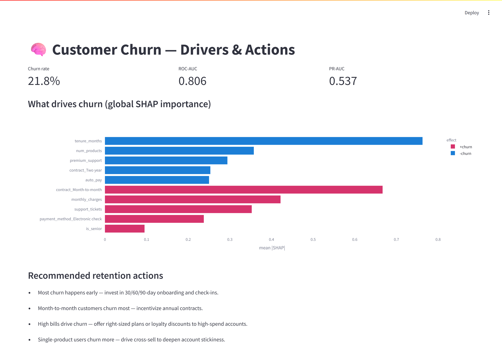

# 🧠 Customer Churn Prediction + Explainability (SHAP)

**Business question:** *Which customers are about to leave, **why**, and what should we do about it?* A churn score alone doesn't retain anyone — teams need the drivers and the actions.

This project predicts churn on a SaaS/telecom-style dataset and uses **SHAP** to turn the model into a ranked list of drivers and **plain-English retention recommendations**, plus per-customer reason codes.

---

<!-- portfolio-visuals -->

## 🔧 How it works



*End-to-end flow from input to output — see [`architecture.svg`](./architecture.svg).*

## 📊 Live dashboard



*Real screenshot of the Streamlit app on synthetic data — no API key needed. Run it with `streamlit run dashboard.py`.*

---


## Key findings (what the business should act on)

**Top 3 churn drivers** (validated with SHAP, directions correct):

1. **Short tenure** — churn is concentrated in the first months *(↓ churn as tenure grows)*.
2. **Month-to-month contracts** — by far the biggest *increaser* of churn risk.
3. **High monthly charges** — price sensitivity drives departures.

Other significant drivers: few products held, frequent support tickets, no premium support, no auto-pay, electronic-check payment, fiber-optic service.

**Recommended retention actions** (auto-generated from the drivers):

- Invest in **30/60/90-day onboarding** — most churn happens early.
- **Incentivize annual contracts** for month-to-month customers.
- **Right-size plans / loyalty discounts** for high-bill accounts.
- **Cross-sell** to single-product users to deepen stickiness.
- **Proactive support** follow-ups after repeated tickets.

**Model performance (held-out test set):**

| Model | ROC-AUC | PR-AUC | Precision | Recall | F1 |
|-------|--------:|-------:|----------:|-------:|---:|
| Logistic Regression | **0.826** | 0.592 | 0.43 | 0.73 | 0.54 |
| XGBoost | 0.806 | 0.537 | 0.59 | 0.33 | 0.42 |

> **Honest read:** the data's signal is largely linear, so the well-specified **logistic regression** edges out XGBoost on ranking (ROC-AUC). XGBoost is used for SHAP tree explanations and offers higher precision (fewer false alarms) at the default threshold. The threshold is a **business lever** — tune it to your retention budget (recall vs. precision).
>
> **Validation that the explanations are trustworthy:** the data is synthetic with *known* drivers, and SHAP recovered every top driver with the correct direction.

## Demo


Per-customer reason codes (`explain_customer`):

```json
{
  "churn_probability": 0.78,
  "top_reasons": [
    {"feature": "contract_Month-to-month", "shap": 0.92, "effect": "+churn"},
    {"feature": "tenure_months",           "shap": 0.55, "effect": "+churn"},
    {"feature": "monthly_charges",         "shap": 0.31, "effect": "+churn"},
    {"feature": "premium_support",         "shap": -0.18, "effect": "-churn"}
  ]
}
```

## How it works

```
synthetic churn data ─► preprocess (one-hot + scale) ─► train ─┬─ LogisticRegression
                                                               └─ XGBoost
                                                                     │
                              evaluate (ROC-AUC, PR-AUC, P/R/F1)     │
                                                                     ▼
                                                   SHAP (TreeExplainer)
                                                          │
                          ┌───────────────────────────────┼───────────────────────────┐
                          ▼                                ▼                            ▼
                  global drivers + direction      per-customer reason codes     plain-English actions
```

## From probability to decision: who do we actually call?

An AUC doesn't tell anyone who to contact. `src/decision.py` turns scores into a
**profit-maximising retention decision** using the campaign economics — value of a
saved customer (`retain_rate × CLV`), the `offer_cost`, and the cost of missing a
churner. It sweeps the probability threshold and picks the one that maximises
expected profit, and **declines to run a campaign at all** when the offer isn't
worth it:

```python
from src.decision import optimize_threshold
d = optimize_threshold(y_test, proba, clv=1000, offer_cost=50, retain_rate=0.30)
d.threshold, d.n_contacted, d.expected_profit   # e.g. 0.11, 1071, +60,150
```

The default-economics run contacts ~1,071 customers at a profit-optimal threshold
of **0.11** (far from the naive 0.5) for an expected **+₹60k** campaign profit.

## Deployable: batch-scoring API

A model in a notebook can't run a campaign. `src/service.py` is a **FastAPI**
microservice that exposes the trained pipeline over HTTP — POST a batch of
customers, get back for each one a probability, a profit-based **contact / monitor**
decision (using the optimised threshold above), the **SHAP reason codes**, and a
concrete **retention action**. SHAP is computed once per batch, so nightly scoring
stays cheap.

```bash
uvicorn src.service:app --reload     # or: python -m src.service  (port 8000)
```

```bash
curl -X POST localhost:8000/score -H "Content-Type: application/json" -d '{
  "customers": [{
    "customer_id": "C123", "tenure_months": 1, "monthly_charges": 95,
    "support_tickets": 6, "num_products": 1, "is_senior": 1, "auto_pay": 0,
    "premium_support": 0, "contract": "Month-to-month",
    "payment_method": "Electronic check", "internet_service": "Fiber optic"
  }]
}'
```
```jsonc
{ "threshold": 0.11, "n_scored": 1, "n_to_contact": 1, "results": [{
  "customer_id": "C123", "churn_probability": 0.82, "decision": "contact",
  "risk_band": "high",
  "top_reasons": [{"feature": "tenure_months", "shap": 0.7, "effect": "+churn"}, ...],
  "recommended_action": "Most churn happens early — invest in 30/60/90-day onboarding..."
}]}
```

Pydantic validates every record (e.g. `is_senior` must be 0/1), so malformed input
gets a clean `422` instead of a bad score. `GET /health` reports readiness and the
active threshold.

## Tech stack

- **ML:** scikit-learn (LogReg, pipelines), XGBoost
- **Explainability:** SHAP (TreeExplainer)
- **Decisioning:** cost-based threshold optimisation (`src/decision.py`)
- **Serving:** FastAPI batch-scoring microservice (`src/service.py`) with Pydantic validation
- **Viz/App:** matplotlib, Plotly, Streamlit
- **Observability:** structured logging via `src/logging_utils.py` (`LOG_LEVEL` env)
- **Deploy:** `Dockerfile` + `docker-compose.yml`; GitHub Actions CI runs the suite
- **Tests:** pytest (24 tests, including a check that SHAP recovers known drivers, that a worthless offer contacts nobody, and that the API scores a batch + rejects bad input)

## Setup & run

```bash
cd 07-churn-prediction-shap
python -m venv .venv && source .venv/bin/activate   # Windows: .venv\Scripts\activate
pip install -r requirements.txt

python -m src.generate_data     # synthetic data/churn.csv
python -m src.run_pipeline      # train, evaluate, SHAP drivers, recommendations, plot
uvicorn src.service:app         # batch-scoring REST API on :8000
streamlit run dashboard.py      # interactive drivers + single-customer scoring
pytest -q
```

## Project structure

```
07-churn-prediction-shap/
├── dashboard.py            # Streamlit: drivers + per-customer reason codes
├── src/
│   ├── generate_data.py    # synthetic churn data with known drivers
│   ├── data.py             # load, split, preprocessing (ColumnTransformer)
│   ├── model.py            # LogReg + XGBoost, evaluation metrics
│   ├── explain.py          # SHAP drivers, recommendations, reason codes
│   ├── decision.py         # cost-based threshold optimisation
│   ├── service.py          # FastAPI batch-scoring microservice
│   ├── logging_utils.py    # structured logging + timing
│   └── run_pipeline.py     # end-to-end report + driver plot
├── notebooks/
│   └── churn_story.ipynb   # the analysis narrative
├── tests/                  # 24 pytest tests
├── Dockerfile              # containerised Streamlit app
├── docker-compose.yml
├── .github/workflows/ci.yml
├── requirements.txt
└── .gitignore
```

## Possible extensions

- **Uplift modeling** — target customers whose churn is *changeable*, not just likely.
- **Calibration** (Platt/isotonic) so probabilities are decision-ready.
- **Monitoring** for drift in drivers and score distribution over time.
- Export an **at-risk customer list** with reason codes to the CRM.
